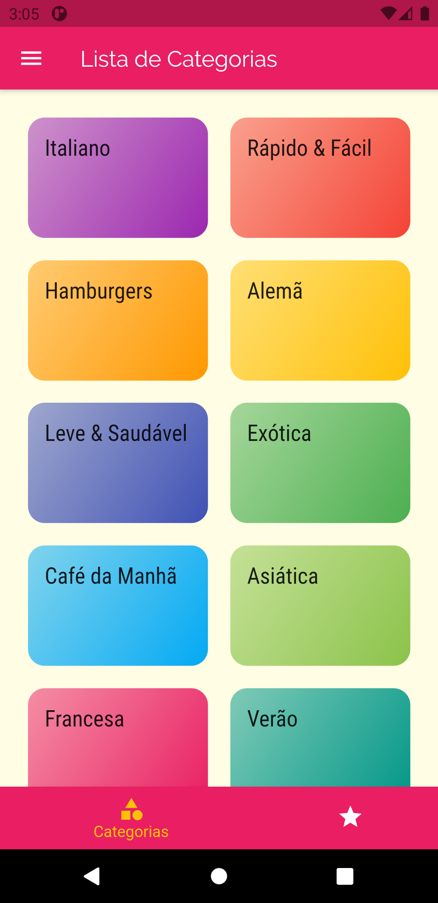
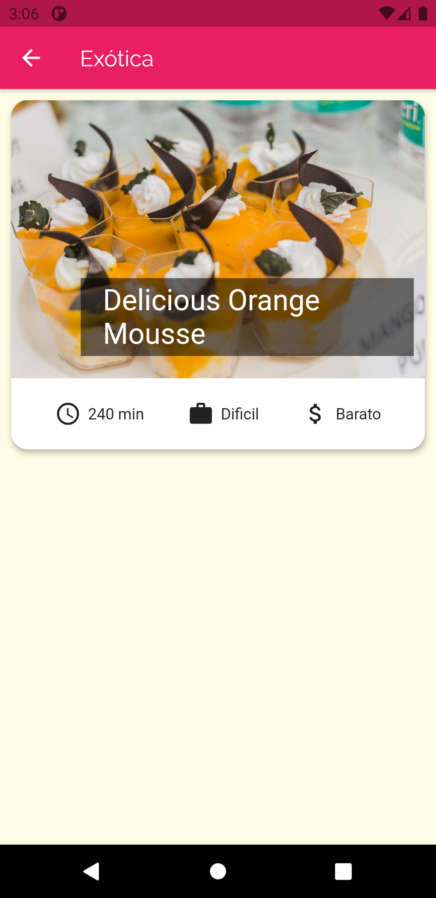
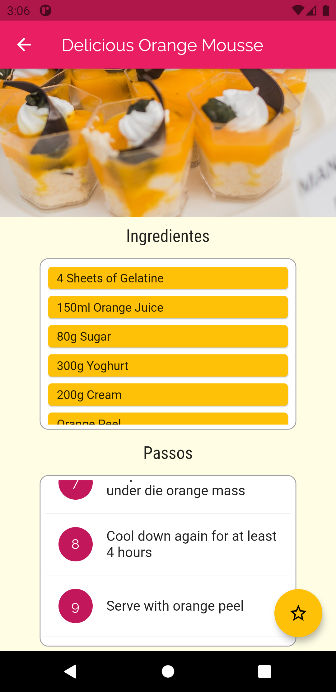
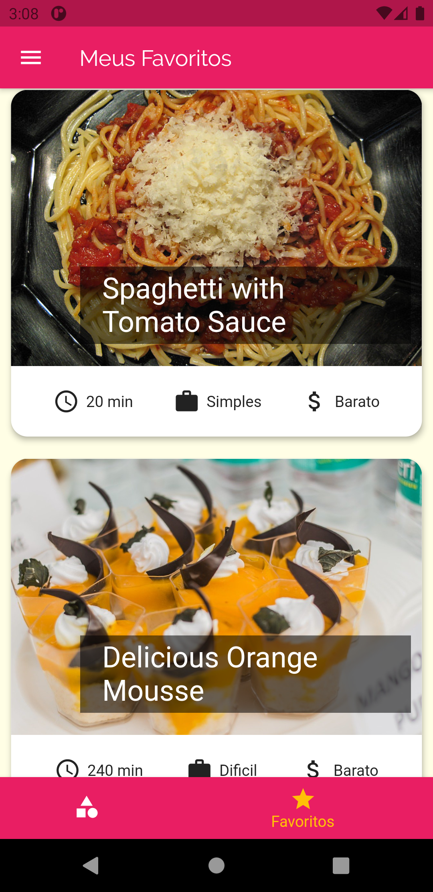
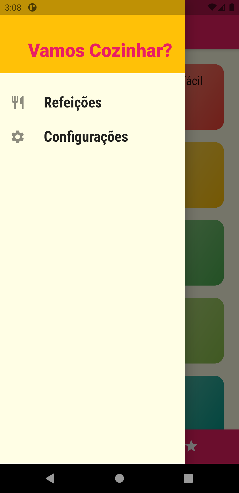
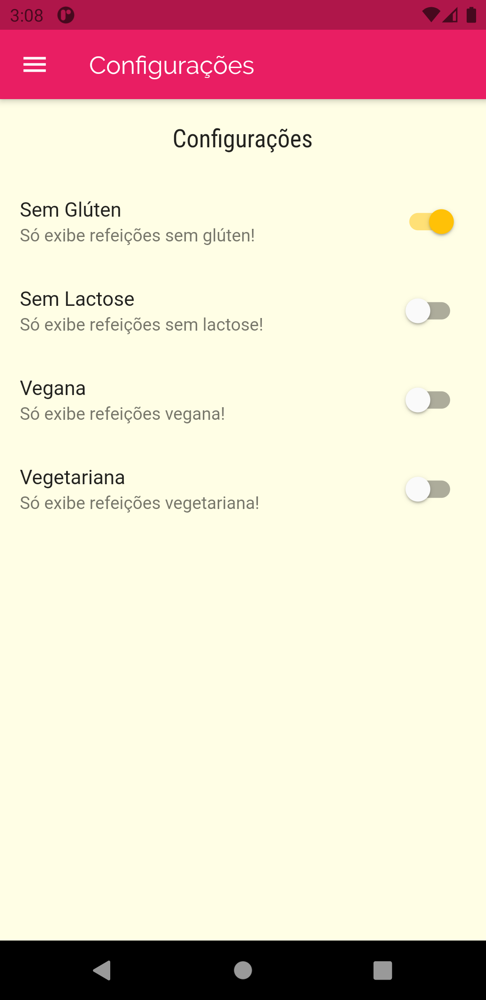

# meals

## Projeto feito na aula do curso na udemy

#### O aplicativo e um projeto que usuário adiciona comida com a receita o aplicativo já tem umas receita de comida

<table>
  <tr>
    <td></td>
    <td></td>
    <td></td>
  </tr>
</table>

#### O usuário pode adicionar a receita no favorito e nas configurações, o usuário pode adicionar filtro para só pegar receitas que passa no filtro como receita sem glúten ou vegetariana.

<table>
  <tr>
    <td></td>
    <td></td>
    <td></td>
  </tr>
</table>
